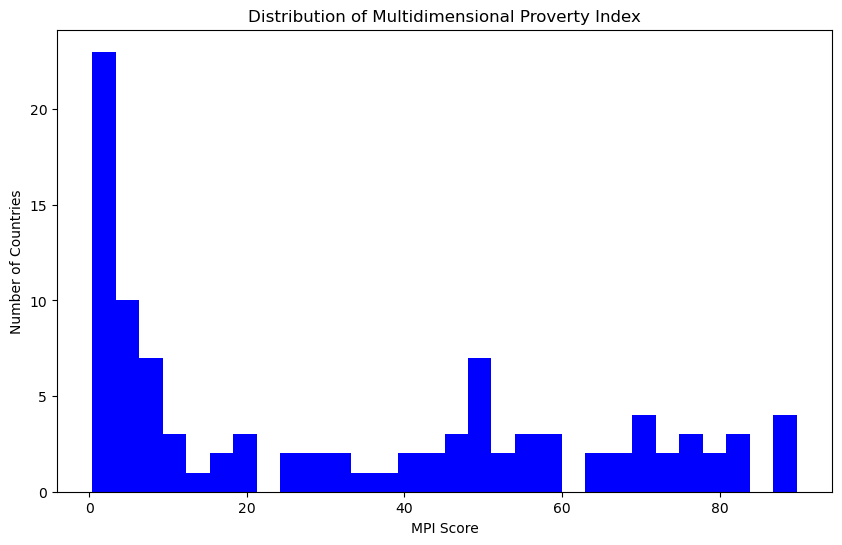
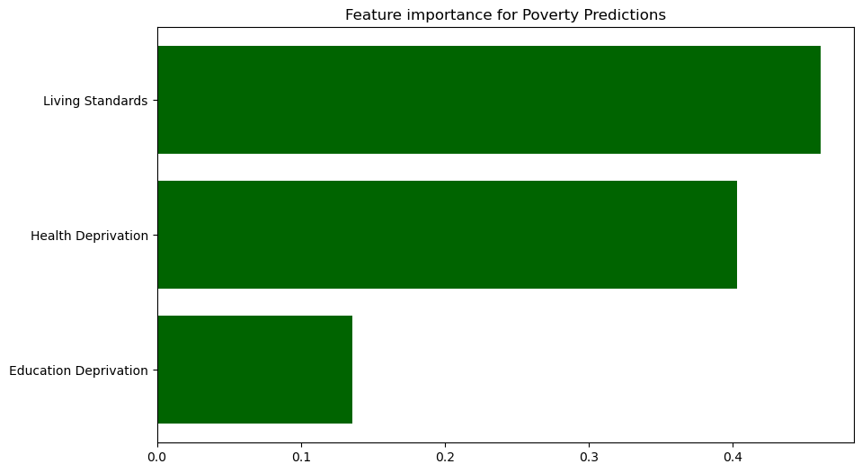
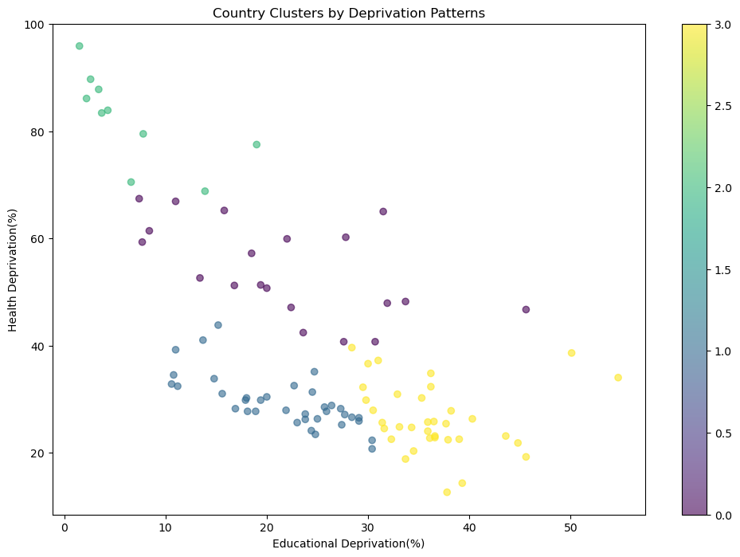
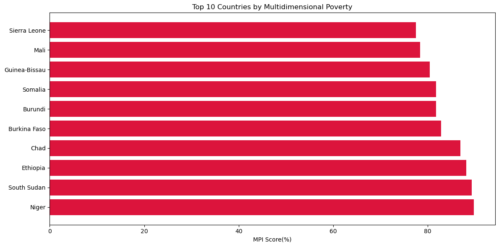
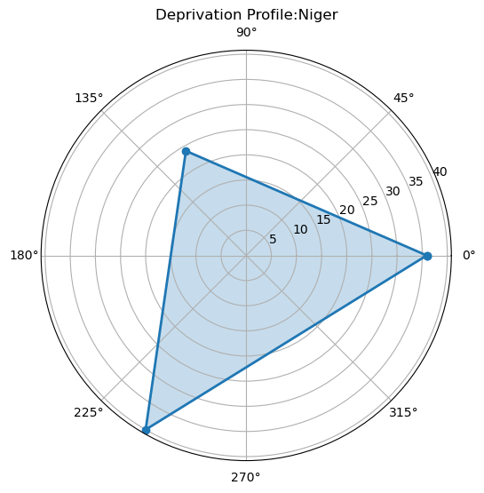

# Wk2-AI-assignment
# MULTIDIMENSIONAL POVERTY ANALYSIS
This project analyses multidimensional poverty data using statistical methods, machine learning, and visualization techniques. The analysis includes data cleaning, exploratory data analysis (EDA), predictive modelling, clustering, and visualization of poverty patterns across countries.

## Screenshot Comparing testing and predicted values
.jpg )
## Table of Contents
1. [Project Overview](#project-overview)
2. [Dataset](#dataset)
3. [Requirements](#requirements)
4. [Implementation](#implementations)
5. [Results](#results)
6. [Visualizations](#visualizations)
7. [Usage](#usage)

## Project Overview
The project aims to:
- Clean and preprocess multidimensional poverty data
- Explore relationships between different poverty indicators
- Predict poverty levels using a Random Forest regressor
- Cluster countries based on deprivation patterns
- Visualize key findings through various plots

## Dataset
The dataset (`multidimensional_poverty.csv`) contains information about poverty indicators across multiple countries, including:
- Multidimensional Poverty Index (MPI) scores
- Education, health, and living standards deprivation percentages.
- Population in poverty
- Intensity of deprivation
- National poverty line statistics

## Requirements
To run this code, you'll need:
- Python 3.x Version
- Jupyter Notebook(optional)
- Required libraries:
  ```bash
  numpy
  pandas
  matplotlib
  scikit-learn
## Implementation
The analysis is divided into 5 main steps:

### 1. Data Cleaning
- Handling missing values (represented by '..')
- Converting data types
- Removing rows with missing MPI values
- Processing population numbers (removing commas)

### 2. Exploratory Data Analysis
- Basic statistical analysis of key indicators.
- Correlation matrix calculation
- Distribution visualization of MPI scores

### 3. Machine Learning Model
- Random Forest Regressor to predict MPI scores
- Features: Education, Health, and living standards deprivation
- Model evaluation using R-squared metric
- Feature importance analysis

### 4. Poverty Cluster Analysis
- K-means clustering (k=4) to group countries by deprivation patterns
- Visualization of clusters based on Education and Health deprivation

### 5. Key Visualizations
- Top 10 most deprived countries (horizontal bar chart)
- Radar chart for detailed country deprivation profile

## Results
- The Random Forest model achieved an R-squared score of [score will appear when code is run]
- Feature importance analysis shows [most important feature] as the strongest predictor
- Countries are grouped into 4 distinct clusters based on deprivation patterns

## Visualizations
The code generates several visualizations saved as PNG files:
1. - Histogram of MPI scores distribution
2.  - Horizontal bar chart of feature importance
3.  - Scatter plot of country clusters
4.  - Horizontal bar chart of top 10 deprived countries
5.  - Radar chart for specific country's deprivation profile

## Usage
1. Ensure all required libraries are installed
2. Download the dataset: [multidimensional_poverty.csv](multidimensional_poverty.csv)
4. Place the `multidimensional_poverty.csv` file in the same directory
5. Run the script in a Pyhton environment or Jupyter notebook
6. Generated visualizations will be saved in the same directory

To analyze a specific country's deprivation profile, call:
```python
plot_radar_chart('Country_Name')
